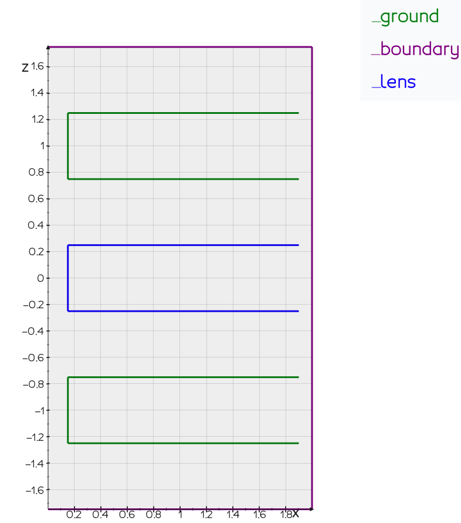

# Einzel lens

## Introduction

This example walks you through the code of [examples/einzel-lens.py](https://github.com/leon-vv/Traceon/blob/main/examples/einzel-lens.py). We will
compute the electrostatic field inside an axial symmetric einzel lens and trace a number of electrons through the field. Please follow
the link to find the up-to-date version of the code, including the neccessary `import` statements to actually run the example. To install Traceon,
please first install [Python](https://www.python.org/downloads/) and use the standard `pip` command to install the package:
```bash
pip install traceon
```

## Defining the geometry

First, we have to define the geometry of the element we want to simulate. In the boundary element method (BEM) only the boundaries of the
objects need to be meshed. This implies that in a radial symmetric geometry (like our einzel lens) our elements will be lines. To find the true
3D representation of the einzel lens, image revolving the line elements around the z-axis. The code needed to define the geometry is given below. 
```Python
# Dimensions of the einzel lens.
THICKNESS = 0.5
SPACING = 0.5
RADIUS = 0.15

# Start value of z chosen such that the middle of the einzel
# lens is at z = 0mm.
z0 = -THICKNESS - SPACING - THICKNESS/2

boundary = T.Path.line([0., 0., 1.75],  [2.0, 0., 1.75]).extend_with_line([2.0, 0., -1.75]).extend_with_line([0., 0., -1.75])

margin_right = 0.1
extent = 2.0 - margin_right

bottom = T.Path.aperture(THICKNESS, RADIUS, extent, -THICKNESS - SPACING)
middle = T.Path.aperture(THICKNESS, RADIUS, extent)
top = T.Path.aperture(THICKNESS, RADIUS, extent, THICKNESS + SPACING)
    
boundary.name = 'boundary'
bottom.name = 'ground'
middle.name = 'lens'
top.name = 'ground'
```

Note that we explicitely assign names to the different elements in our geometry. Later, we will use these names to apply the correct _excitations_
to the elements. Next, we mesh the geometry which transforms it into many small line elements used in the solver. Note, that you can either supply
a `mesh_size` or a `mesh_size_factor` to the `traceon.geometry.Path.mesh` function. 

```Python
mesh = (boundary + bottom + middle + top).mesh(mesh_size_factor=45)

T.plot_mesh(mesh, lens='blue', ground='green', boundary='purple')
T.show()
```



## Applying excitations

We are now ready to apply excitations to our elements. We choose to put 0V on the 'ground' electrode, and 1800V on the 'lens' electrode. We specify
that the boundary electrode is an 'electrostatic boundary', which means that there is no electric field parallel to the surface ($\mathbf{n} \cdot \nabla V = 0$).

```Python
excitation = T.Excitation(mesh, E.Symmetry.RADIAL)

# Excite the geometry, put ground at 0V and the lens electrode at 1800V.
excitation.add_voltage(ground=0.0, lens=1800)
excitation.add_electrostatic_boundary('boundary')
```

## Solving for the field

Solving for the field is now just a matter of calling the `traceon.solver.solve_direct` function. The `traceon.field.Field` class returned 
provides methods for calculating the resulting potential and electrostatic field, which we can subsequently use to trace electrons.

```Python
# Use the Boundary Element Method (BEM) to calculate the surface charges,
# the surface charges gives rise to a electrostatic field.
field = T.solve_direct(excitation)
```

## Axial interpolation

Before tracing the electrons, we first construct an axial interpolation of the Einzel lens. In a radial symmetric system the field
close to the optical axis is completely determined by the higher order derivatives of the potential. This fact can be used to trace
electrons very rapidly. The unique strength of the BEM is that there exists closed form formulas for calculating the higher
order derivatives (from the computed charge distribution). In Traceon, we can make this interpolation in a single
line of code:
```Python
field_axial = FieldRadialAxial(field, -1.5, 1.5, 150)
```
Note that this field is only accurate close to the optical axis (z-axis). We can plot the potential along the axis to ensure ourselves
that the interpolation is working as expected:

```Python
z = np.linspace(-1.5, 1.5, 150)
pot = [field.potential_at_point([0.0, 0.0, z_]) for z_ in z]
pot_axial = [field_axial.potential_at_point([0.0, 0.0, z_]) for z_ in z]

plt.title('Potential along axis')
plt.plot(z, pot, label='Surface charge integration')
plt.plot(z, pot_axial, linestyle='dashed', label='Interpolation')
plt.xlabel('z (mm)')
plt.ylabel('Potential (V)')
plt.legend()
```


## Tracing electrons

Tracing electrons is now just a matter of calling the `.get_tracer()` method. We provide
to this method the bounds in which we want to trace. Once an electron hits the edges of the bounds the tracing will
automatically stop.

```Python
# An instance of the tracer class allows us to easily find the trajectories of 
# electrons. Here we specify that the interpolated field should be used, and that
# the tracing should stop if the x,y value goes outside ±RADIUS/2 or the z value outside ±10 mm.
tracer = field_axial.get_tracer( [(-RADIUS/2, RADIUS/2), (-RADIUS/2,RADIUS/2),  (-10, 10)] )

# Start tracing from z=7mm
r_start = np.linspace(-RADIUS/3, RADIUS/3, 7)

# Initial velocity vector points downwards, with a 
# initial speed corresponding to 1000eV.
velocity = T.velocity_vec(1000, [0, 0, -1])

trajectories = []

for i, r0 in enumerate(r_start):
    print(f'Tracing electron {i+1}/{len(r_start)}...')
    _, positions = tracer(np.array([r0, 0, 5]), velocity)
    trajectories.append(positions)
```

From the traces we can see the focusing effect of the lens. If we zoom in on the focus we can clearly see the
spherical aberration, thanks to the high accuracy of both the solver and the field interpolation.


